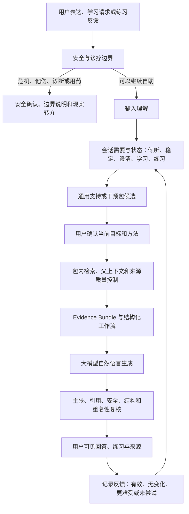

# “此刻”循证心理自助平台技术介绍

**文件性质：** 产品定位、技术架构与建设路线说明
**适用读者：** 具备软件、人工智能、数据或产品技术背景的项目成员与合作伙伴
**文件版本：** V1.0
**编制日期：** 2026 年 8 月 16 日

---

## 摘要

“此刻”是一套以自然对话为入口、以循证心理干预协议为内核、以可追溯知识库为证据层的心理自助平台。它不把大模型包装成心理咨询师，也不以替代诊断、治疗或危机服务为目标，而是在明确的使用边界内，帮助用户表达当前困扰、理解情绪与行为模式、学习适合此刻的小型心理技能，并对练习结果作出反馈和调整。

项目所解决的不是单纯的心理知识问答问题。传统数字心理课程通常具有较完整的内容结构，但进入成本高、缺少即时回应，用户容易中断；通用人工智能能够自然交流，却可能产生方法混杂、事实无依据、过度推断和风险处置不稳定等问题；简单 RAG 可以找到书中相关片段，但无法独立判断用户此刻更需要被倾听、稳定、澄清、学习还是练习。项目因此将会话理解、干预状态、证据检索、结构化工作流和安全边界拆分为相互约束的层级，而不是把全部责任交给一个提示词或一次模型生成。

当前实现以 DBT 为第一套专业内容和干预方法，已经形成整书来源精确摄取、Evidence Bundle、双模式交互、安全优先路由、有限多轮状态、结构化练习和工程评测。目标架构则是在保持上述能力的基础上，将 DBT 抽象为第一个独立干预包，后续可以增加 CBT 等其他方法，但每个包都必须拥有独立的适用范围、知识来源、检索规则、干预协议、练习、评测和专业审核，不能让模型在不同流派之间自由拼接。

## 一、项目定义

“此刻”的产品定义是：**一个对话式、可追溯、协议化的心理自助平台。**

所谓“对话式”，是指用户不需要先理解心理学术语或从课程目录中判断自己应该学习什么，可以从一句不完整、模糊甚至重复的表达开始。系统通过安全识别、输入理解和必要的低负担澄清，判断用户当前需要，并用自然语言推进一个最小步骤。

所谓“可追溯”，是指专业解释、适用条件和练习步骤能够回到经过授权的书籍、课程或其他权威资料，系统区分原文证据、结构化摘要和基于用户情境的非诊断性建议。引用不是界面装饰，而是专业主张的可审计依据。

所谓“协议化”，是指系统不会因为模型认为某种建议“听起来合理”就直接输出，而是受到当前干预包的适用范围、流程状态、练习契约、用户反馈和安全规则约束。一个方法被选择后，应在明确目标周期内保持一致，切换方法需要可解释并由用户确认。

项目的简化表达是：

> 会话系统决定此刻应该做什么，RAG 证明为什么可以这样做，大模型负责把它自然地说出来，安全系统决定什么时候不能继续。

## 二、产品定位与边界

产品定位为面向成年用户的心理自助与技能学习工具。主要使用场景包括日常压力、情绪波动、人际困扰、行为冲动后的复盘、明确的 DBT 技能学习以及专业服务之间的辅助练习。产品可以帮助用户更清楚地描述发生了什么、区分事实与解释、理解情绪和行动之间的联系，并完成一个低负担练习，但不根据有限对话给出疾病诊断、药物调整、他人动机判断或人格标签。

系统不主动声称能够治疗抑郁、焦虑、人格障碍或其他精神疾病。对于正在接受治疗的用户，产品只能作为辅助工具，不能干扰既有诊疗。对于急性自伤、他伤、现实失控或需要即时医疗处置的情况，产品应停止普通技能教学，优先帮助用户确认现实安全并转向当地专业资源。

这种边界不是为了降低产品价值，而是为了明确产品真正负责的部分。心理自助平台可以扩大专业知识和技能的可及性，也可以帮助用户在两次人工服务之间完成练习，但它不能获得治疗师的现实观察、伦理责任、持续评估和紧急处置能力。产品需要把“可以帮助什么”和“什么时候必须退出”同时设计出来。

## 三、产品形态

### 3.1 陪伴对话

陪伴对话是默认入口。用户首先表达当下困扰，系统优先回应用户已经说出的事实和感受，不猜测原因、诊断或他人意图。随后根据会话需要，选择一个低负担澄清问题、一个稳定步骤或一个可以立即完成的行动。专业知识和来源默认折叠，避免书本内容压过用户当前体验。

陪伴模式不是没有专业知识的闲聊。它与知识伴读共享同一安全层、输入理解、干预决策和证据层，只是在表达顺序上先回应人，再提供可展开的知识和技能。每轮默认只推进一个问题、技能或行动，使用户能够真实反馈这一步是否有帮助。

### 3.2 知识伴读

知识伴读面向主动学习和深入理解的用户。系统先解释 DBT 技能的原理、适用范围和关键区别，再提供练习方式、书中章节和页码来源。相比直接展示 OCR 原文，伴读模式需要将多个相关片段组织成易于理解的知识结构，同时保留逐主张来源，使用户能够检查系统是否正确解释了书本。

伴读不是独立于对话的静态百科。用户可以从知识进入练习，也可以把学习内容带回自己的具体情境；系统仍然需要避免把一般知识直接套用为个体诊断或替用户填写练习答案。

### 3.3 结构化练习与记录

技能只有进入行动，才能形成心理自助闭环。平台将部分 DBT 技能转化为结构化练习，明确练习目的、预计时间、步骤、暂停方式和来源。用户可以将刚才的原话带入练习，但系统只复制和组织用户已经提供的信息，不自动判断哪些解释是真实的，也不替用户推断他人的动机。

记录层用于保存用户做过的练习、当时的目标、采取的步骤和主观反馈。它可以帮助后续会话了解什么可能有效、什么没有变化或使用户更难受，但不用于在用户不知情的情况下生成永久人格画像。后续的量表、趋势和专业人员查看，也应建立在明确同意、最小数据和权限审计基础上。

## 四、核心运行架构



架构中的关键原则是安全优先顺序不可被模型越过。输入在检索和模型调用之前完成危机、他人安全、诊断和用药边界识别；通过安全门后，系统才判断用户表达的作用域和当前需要。检索规划依赖会话决策，而不是先从所有资料中搜索几个片段再让模型临场判断。

大模型可以参与自然语言理解、候选组织和最终表达，但不能新增证据、改写引用标识、把未经审核的 Wiki 草稿当成专业结论，也不能覆盖安全和干预状态。模型超时、结构无效、引用错误或证据复核失败时，系统应退回受控回答或证据模式，而不是继续自由生成。

## 五、会话理解与干预状态

心理自助对话不能只靠关键词路由。用户说“我很焦虑”可能是在描述自己的体验，也可能在转述别人；说“我还是放不下”往往意味着上一轮没有解决需要，而不是应当再次展示同一技能；说“完全没变化”需要系统重新判断干预，而不是把它当成普通新问题。

当前会话层将输入理解和干预决策分开。输入理解识别自我体验、DBT 学习、普通对话、明确无关和不确定范围，并记录主体、情绪和情境信号。干预状态进一步维护用户当前需要、困扰强度、正在使用的技能、上一次干预和用户对该干预的反馈。状态不负责诊断，而是为了让下一轮对话能够前进。

系统默认使用有限历史，只保留理解指代和短追问所需的少量对话，降低第三方模型处理和长期误推断风险。未来如增加长期记忆，应该保存用户明确确认的目标、偏好和练习结果，而不是自动写入“核心信念”“依恋类型”“防御机制”等推断性结论。

## 六、专业干预包

目标平台采用“公共运行时加专业干预包”的结构。公共运行时包括安全、用户同意、会话状态、通用支持、模型适配、日志、权限和统一界面；干预包包含具体方法的适用范围、排除条件、知识、检索、干预规划、结构化练习、专业审核和独立评测。

建议的基础接口如下：

```ts
type InterventionPack = {
  id: "dbt" | "cbt";
  version: string;
  displayName: string;
  intendedUses: string[];
  exclusions: string[];
  knowledge: KnowledgePackage;
  retrieval: RetrievalEngine;
  planner: InterventionPlanner;
  workflows: WorkflowDefinition[];
  evalSuite: EvalCase[];
  reviewStatus: "draft" | "professionally-reviewed";
};
```

第一套干预包是 DBT，重点包括正念、痛苦耐受、情绪调节、人际效能和行为链等内容。未来增加 CBT 时，需要重新确定目标问题和权威资料，建设自动化思维、认知重构、行为激活、暴露或问题解决等对应流程。CBT 包不是把提示词中的“DBT”替换成“CBT”，也不能只依赖模型潜在知识；它需要独立来源、授权、协议、工作流、审核和评测。

普通用户不一定需要选择心理治疗流派。产品可以围绕“稳定情绪”“处理反复担忧”“理解低落和行动减少”“改善沟通”等目标组织入口，由系统提出少量透明候选并说明原因，最终由用户确认。确认后应在一个目标周期内保持包锁定；切换包需要说明理由并记录，避免一轮使用 DBT、下一轮无提示切换到 CBT 或其他流派。

## 七、RAG 与知识架构

### 7.1 RAG 的职责

RAG 在本项目中是证据引擎，不是完整的心理干预引擎。它负责从当前干预包中找到相关原文和上下文，支持定义、适用性、练习和边界主张，并提供用户可检查的章节和页码。一般倾听、普通问候和低负担澄清不必强行引用；一旦进入专业解释或练习，系统就需要调用当前包内的证据和工作流。

简单的“检索若干片段加大模型生成”不足以完成这一职责。检索结果需要经过章节父块补全、来源质量过滤和重排，并形成 Evidence Bundle。Evidence Bundle 区分检索证据、技能卡、可声明主张和逐主张引用，使后续生成和复核能够判断某句话是否真正由对应来源支持。

### 7.2 原始事实层与派生知识层

知识系统保留 source-exact 原始片段，任何 OCR 清洗、章节重排、Wiki、概念关系和技能摘要都作为派生内容存在，不能覆盖原始证据。自动生成的 LLM Wiki 可以用于导航、父上下文和召回扩展，但不能替代专业审核，也不能成为唯一事实来源。

这一设计直接回答了“为什么不一步到位做 LLM Wiki”：扫描资料中的 OCR 错误、表格顺序和章节语境可能被自动总结进一步放大；Wiki 数量增加也不能证明知识正确。正确关系是原书页面构成事实底座，结构化节点帮助寻找和组织，专业审核决定哪些表达可以稳定发布，逐主张引用保证运行时回答可核查。

### 7.3 检索质量演进

当前检索以来源精确片段、DBT 概念扩展和 BM25 风格稀疏排序为基础，已经建立固定主题评测。下一步可以对照 embedding、hybrid retrieval 和 reranker，但是否采用应由独立人工标注集上的 Recall@5、MRR、引用支持率、低质量来源占比和延迟共同决定。使用更复杂框架本身不是质量证据。

检索评测和生成评测需要分开。检索没有找到正确证据、找到了错误上下文、模型在正确证据上扩写过度、引用错配以及方法选择不适合，是五类不同故障，不能用一个总分掩盖。

## 八、安全、专业与数据治理

安全系统独立于 DBT、CBT 和任何知识库，始终优先运行。当前安全分类覆盖直接和间接自伤、他伤、摔砸或动手、暴力暴露、诊断、用药以及多轮上下文继承。高风险情况下，系统应先询问现实安全、鼓励联系可信任的人和当地紧急资源，而不是继续普通技能教学。

免责声明不是安全机制，关键词命中也不是完整安全能力。进入真实用户试用前，需要由独立人员建立自然语言改写、对抗表达和多轮升级测试，统计漏报、误报和处置合理性，并与真实热线或人工转介流程进行桌面演练。工程回归只能证明固定案例中的行为，不能被表述为现实世界零风险。

心理对话、练习记录、量表和风险信息属于高度敏感数据。平台应贯彻最小收集原则，明确数据用途、存储位置、保存期限、第三方模型处理范围、用户访问、导出和删除方式。模型密钥只保存在服务器环境变量或部署平台 Secret 中，不进入浏览器和公开仓库。未经单独授权，用户对话不用于模型训练或与当前服务无关的画像。

专业治理需要给内容和流程建立版本、审核人、审核时间和状态。工程团队负责实现证据契约和审核工具，但不能由开发模型自我审核专业结论。内容方或专业人员需要对关键 OCR、技能解释、适用范围和练习流程进行抽检或全量审核，并保留失败和整改记录。

## 九、当前实现基础

当前仓库位于 `D:\DBT\demo`，主开发分支为 `agent/unified-conversation-routing`，对应最新已推送提交为 `9955b62 fix: unify conversation understanding and routing`，GitHub 上存在 [Draft PR #1](https://github.com/zx070326-hash/cike-dbt-demo/pull/1)。技术栈包括 TypeScript、React 19、Next 16、Vinext/Vite、Cloudflare Worker 形态和 Drizzle 数据结构。

知识清单显示，两册 DBT 资料共登记 1,176 个 PDF 页面，其中 1,156 个页面包含可检索内容、20 个为空白页；当前生成 1,189 个 source-exact 原文片段、1,156 个父级上下文块，覆盖 681,595 个 OCR 字符，机械字符覆盖率为 100%，孤立非空页面和未解析 Wiki 链接均为 0。当前存在 18 个结构化导航节点，但专业审核数为 0。

这意味着“全书是否进入知识库”需要分两层回答：从工程摄取和字符覆盖角度已经完成；从逐页 OCR 人工校对和专业内容验收角度尚未完成。覆盖率证明内容没有在构建过程中被遗漏，不证明每个 OCR 字符正确，也不证明模型已经理解整本书。

当前工程能力包括移动端双模式交互、来源展开、结构化练习、浏览器本地记录、安全优先路由、输入理解、会话需要状态、重复回答防护、受限多轮上下文、闭源模型适配、引用白名单、证据支持复核和失败降级。2026 年 8 月 16 日重新执行完整构建与测试，62 项工程测试全部通过；`npm run lint` 同期通过。上述结果属于工程验证，不是专业审核、独立红队、用户研究或临床疗效证据。

## 十、当前差距

当前主链路仍是 DBT 特定实现，类型、检索规划、模型提示和界面文案中存在 DBT 绑定，尚未建立正式的干预包注册表、`activePackId`、用户确认和包锁定。因此多方法切换属于目标能力，不是当前完成能力。

两册资料的商业使用授权需要内容方确认，OCR 尚未逐页人工校对，18 个结构化导航节点尚未完成专业审核。现有危机工程没有经过独立临床红队、真实热线或人工转介演练。服务端已经定义用户同意、加密练习载荷、会话摘要、安全计划、内容版本、专业审核和审计事件等数据结构，但真实账号、加密读写、后台权限、用户导出和删除尚未形成完整产品，当前练习记录主要保存在浏览器本地。

项目也没有形成临床效果证据，不能声称治疗焦虑、抑郁或其他疾病。正式运营所需的部署、监控、备份、数据保留、隐私说明、供应商治理和持续内容更新流程，需要在产品化阶段单独建设。

## 十一、建设路线

第一阶段应完成现有 DBT 主链路的平台化抽象。先定义干预包接口和注册表，将现有知识、检索规划、工作流和评测包装为 `dbt` 包，在不改变用户行为的前提下保持现有工程回归通过。随后增加 `general-support` 状态、`activePackId`、用户确认和包隔离测试，使公共运行时不再与 DBT 内容硬绑定。

第二阶段完成 DBT 包的产品化质量门槛，包括书籍授权、关键 OCR 抽检、技能卡和结构化工作流专业审核、独立检索标注、危机红队、真实转介演练、账号和敏感数据最小闭环。该阶段的目标不是增加更多技能数量，而是让当前包可审核、可解释、可版本化并适合受控试用。

第三阶段依据明确目标建设 CBT 包。需要先确定目标问题和权威资料，再建设对应知识、认知与行为流程、适用和排除条件、专业审核及独立评测。CBT 包完成后，用户可以手动选择或接受透明候选推荐，但系统不进行疾病诊断式分配。

第四阶段根据真实使用证据建设课程、音视频、量表、提醒、专业人员端和组织管理能力。任何新功能都应回答它服务于哪个用户目标、产生哪些敏感数据、如何评估效果以及失败时怎样处理，避免产品重新退化为功能堆叠。

## 十二、技术路线判断

项目不采用纯 Prompt 作为核心，因为提示词可以约束语气和输出格式，却难以稳定管理多轮状态、安全优先级、上次方法反馈、证据引用和干预包隔离。Prompt 是自然语言表达层工具，不是完整运行时。

项目现阶段不把微调作为第一优先级。微调可以改善语气、分类或特定任务行为，但不能自动解决内容授权、知识更新、页码溯源、危机转介和版本审计。只有在积累经过授权、专业标注并具备独立评测的数据后，才能判断微调是否带来超出显式工作流和 RAG 的可测提升。

项目也不追求自治 Agent 数量。安全、检索、会话和复核需要清晰组件边界，但不需要每层都变成可自由规划的 Agent。心理自助场景更重视可预测、可测试和失败降级，当前适合继续使用模块化单体架构，待真实规模和集成需求出现后再拆分服务。

模型供应商保持可替换。当前可使用 DeepSeek V4 Flash 等闭源前沿模型，但模型只承担受限理解与表达，核心证据、状态、工作流和安全不绑定单一供应商。没有模型密钥时，系统仍应能够提供部分书内证据、核心技能和安全边界的受控降级。

## 十三、质量评估体系

项目评估分为工程、专业内容、安全、可用性和效果研究五层。工程层检查构建、API、交互、检索、引用和状态契约；专业层检查 OCR、来源、技能解释和工作流是否准确；安全层检查危机漏报、误报、诊疗越界和现实处置；可用性层观察目标用户能否理解、完成和退出；临床效果则需要针对目标人群、冻结版本和明确对照另行研究。

检索建议报告 Recall@5、MRR、父章节命中、低质量来源占比和空结果；引用建议报告主张覆盖率、引用支持率及页码和片段标识完整率；会话建议评估是否先回应用户、是否只推进一步、是否重复、是否根据反馈调整；安全建议分别统计直接危机、间接风险、诊断、用药和他人安全，不用一个平均总分掩盖阻断风险。

所有评测需要绑定代码、知识、模型配置、提示和测试集版本。模型、检索或内容发生变化时，相关测试必须重新执行。自动评分和同一模型自检只能作为工程信号，不能替代独立标注、专业审核和真实用户研究。

## 十四、产品价值与长期壁垒

产品价值不在于拥有最多的心理学材料，而在于同时完成四件事：比传统课程更容易进入和坚持；比普通人工智能对话更受专业协议约束；比简单 RAG 更理解当前会话阶段和用户反馈；比单一方法应用更具扩展性，但又不让不同方法无规则混合。

长期壁垒将由五部分组成：经过授权和审核的干预包；来源、主张和工作流之间的证据契约；对模糊表达、多轮反馈和方法切换的会话状态；独立安全与真实转介能力；绑定版本的专业评测和用户反馈。模型本身可以替换，页面样式也可以模仿，但这些内容和治理资产需要持续积累。

从商业形态看，平台可以承载面向个人的心理自助、专业机构的课间或咨询间辅助练习、企业或学校的非诊断性心理技能教育，以及经合规论证后的专业人员协作。不同场景不能共用同一数据和责任假设，进入具体业务前仍需重新确定人群、声明、权限和转介条件。

## 十五、项目结论

“此刻”不是一个心理聊天外壳，也不是传统知识库问答的垂直包装。它要建设的是一个受到安全、方法、证据和用户反馈共同约束的心理自助运行时。当前 DBT 实现已经证明关键工程链路可以落地，并提供了第一套知识和交互基础；下一步工作的重点不是继续增加提示词或页面装饰，而是完成干预包抽象、专业审核、数据闭环、独立安全评测和受控产品化。

项目应始终保持明确的证据边界：全书进入知识底座不等于全书人工准确，引用存在不等于主张得到支持，工程测试通过不等于现实安全，用户满意不等于临床有效。只有把这些层级分开，平台才可能在保持自然体验的同时建立真正可持续的专业可信度。

## 附录 A：代码阅读入口

| 文件 | 作用 |
| --- | --- |
| `app/api/chat/route.ts` | HTTP 输入、历史归一化和体验模式入口 |
| `lib/application/run-assistant-turn.ts` | 一轮会话的安全、状态、检索、生成和复核编排 |
| `lib/safety/classifier.ts` | 自伤、他伤、失控、诊断和用药分类 |
| `lib/conversation/input-understanding.ts` | 输入作用域、主体和信号理解 |
| `lib/conversation/session-decision.ts` | 会话需要、强度、上次干预和反馈状态 |
| `lib/retrieval/planner.ts` | 检索与澄清规划 |
| `lib/retrieval/engine.ts` | 原文、概念和来源质量检索 |
| `lib/retrieval/evidence-bundle.ts` | 证据记录和逐主张绑定 |
| `lib/model-adapter.ts` | 闭源模型适配和失败降级 |
| `lib/grounding.ts` | 定义、适用性、练习和边界主张复核 |
| `lib/workflows/catalog.ts` | 结构化练习和审核状态 |
| `app/page.tsx` | 双模式、技能、练习和记录界面 |
| `data/knowledge/manifest-v2.json` | 知识覆盖和专业审核清单 |
| `tests/`、`data/eval/` | 工程、检索、会话和安全固定测试 |

## 附录 B：内部文档

- [甲方项目立项报告](此刻循证心理自助平台项目立项报告.md)
- [V3 质量优先架构](V3_QUALITY_FIRST_ARCHITECTURE.md)
- [RAG 与 Evidence Bundle 契约](V3_RAG_EVIDENCE_CONTRACT.md)
- [当前实施状态](IMPLEMENTATION_STATUS.md)
- [知识清单](../data/knowledge/manifest-v2.json)
- [Draft PR #1](https://github.com/zx070326-hash/cike-dbt-demo/pull/1)
