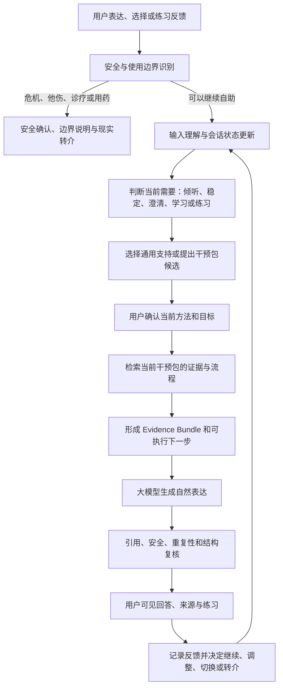

# “此刻”循证心理自助对话平台项目立项报告

**文件性质：** 项目介绍、立项分析与一期建设评估方案
**文件版本：** V1.0（甲方沟通稿）
**编制日期：** 2026 年 8 月 16 日
**项目名称：** “此刻”循证心理自助对话平台（暂定名）
**建设单位：** 待甲方补充
**实施单位：** 待补充

---

## 内容摘要

“此刻”项目拟建设一套面向移动端用户的循证心理自助对话平台。平台不以替代心理咨询师、心理治疗师或精神科医生为目标，而是以自然对话为入口，在明确的使用边界内，帮助用户表达当前困扰、理解情绪与行为模式、学习具有专业依据的心理技能，并将一次对话进一步转化为可以完成、可以记录、可以回顾的小型自助行动。对于涉及诊断、用药、自伤、他伤或者其他不适合继续自助的情况，系统应当优先识别风险，停止普通知识教学，并向用户提供现实世界中的专业求助路径。

项目的核心不是开发一个可以泛泛讨论心理问题的通用聊天机器人，也不是把一本或数本专业书籍简单放入向量数据库。拟建设的产品内核是一套“安全优先、会话理解、干预决策、证据检索、结构化练习、自然语言表达、反馈追踪”相互配合的运行机制。通用大模型主要负责理解自然语言和组织表达，不能越过安全规则、虚构专业依据、擅自诊断，也不能在缺乏协议约束的情况下自由混合不同心理治疗流派。

现有技术原型已经完成两册 DBT 扫描资料的页级摄取、来源精确知识包、带出处的检索回答、移动端双模式交互、安全优先路由、结构化练习以及基础工程测试，具备继续产品化的技术基础。但现有结果仍属于工程原型：整书机械覆盖不等于 OCR 已逐页人工校对，引用存在不等于引用一定支持回答，开发测试通过不等于真实世界安全，模型表现良好也不等于产品具备临床疗效。项目进入甲方正式试用前，仍需完成内容授权、专业审核、独立评测、隐私和数据方案、危机转介演练及受控部署。

综合产品价值、技术基础、实施难度和风险边界，本报告建议项目立项，并采用“平台底座加独立干预包”的渐进建设方式。第一期以通用心理支持和 DBT 干预包为重点，先完成可评审、可追溯、可安全试用的闭环；在一期内容和运行机制通过专业审核后，再建设 CBT 等其他干预包。每个干预包都应具有独立的适用范围、知识来源、检索规则、干预流程、练习、评测集、审核状态和版本记录，避免不同方法在一次干预中被模型随意拼接。

## 一、报告编制说明

### 1.1 编制目的

本报告用于帮助甲方完整理解项目提出的背景、产品定位、建设必要性、总体方案、一期范围、现有基础、实施条件、评估方式和主要风险，并为双方后续确定需求、工期、费用、责任分工和验收标准提供讨论基础。本报告同时承担项目介绍和可行性分析功能，但不替代正式合同、隐私影响评估、内容授权文件、医疗合规意见或临床研究方案。

### 1.2 结构参考

正式信息化项目材料通常围绕“项目概述、现状与必要性、需求分析、总体建设方案、本期建设方案、组织实施、投资与效益、风险及结论”展开。国家电子政务工程项目可行性研究报告编制要求也采用了从需求分析、总体方案到本期建设、效益与风险的完整论证结构。虽然本项目不是政务信息化项目，本报告仍借鉴这一成熟结构，使甲方能够从立项决策而非单一功能演示的角度审视项目。结构参考来源包括[国家电子政务工程建设项目可行性研究报告编制要求](https://www.npc.gov.cn/zgrdw/npc/zt/qt/rdxxhjs/2015-07/28/content_1942053.htm)和[政府投资项目可行性研究报告编写通用大纲（2023 年版）](https://www.ndrc.gov.cn/xxgk/zcfb/ghxwj/202304/P020230407401908422756.pdf)。

心理数字产品具有不同于普通信息系统的特殊风险，因此本报告另外参考了世界卫生组织关于结构化心理自助项目的实施思路、NHS 对数字化心理干预产品的临床内容与效果评估要求，以及美国精神医学学会关于应用背景、可访问性、隐私安全、临床基础、可用性和数据整合的分层评估模型。这些材料用于确定项目能力和评估维度，不代表本项目自动取得任何地区的医疗准入、临床认可或监管授权。

### 1.3 结论边界

本报告将“工程可行”“内容可靠”“真实世界安全”“临床有效”和“可作为医疗产品销售”视为五个不同层级。当前原型能够为工程路线和产品交互提供证据，但不能据此直接推导专业内容已经通过人工审核，也不能据此宣称能够治疗焦虑、抑郁、人格障碍或其他疾病。后续如甲方希望将产品定位从心理自助工具提升为数字疗法、诊疗辅助或医疗服务组成部分，需要重新确定适用人群、治疗协议、专业人员角色、数据治理、临床试验和监管路径，不属于一期默认交付范围。

## 二、项目背景与建设必要性

### 2.1 用户需求正在从“获得知识”转向“完成改变”

心理困扰用户通常并不缺少零散的心理学文章、短视频或概念解释。真正困难的是在情绪较强、注意力有限、问题尚未说清楚的情况下，判断自己此刻需要被倾听、稳定情绪、理清事实、理解模式，还是尝试一个具体行动。传统知识内容往往要求用户先理解完整理论，再自行判断如何应用；普通聊天机器人虽然降低了表达门槛，却容易停留在重复共情、泛化建议或没有依据的自由发挥。前者专业但难以坚持，后者自然但难以信任。

因此，本项目要解决的不是单纯的心理知识供给问题，而是把专业内容转化为一种低负担、可持续的使用过程：用户可以先自然表达，系统只推进一个当前最有价值的问题或行动；需要时再展开知识和来源；完成练习后记录真实反馈；如果方法没有帮助，系统能够根据反馈换一种切入方式，而不是重复同一段回答。产品价值由此从“回答过问题”转向“帮助用户完成一次有依据的小型自助过程”。

### 2.2 通用人工智能无法天然满足专业约束

前沿大模型能够生成流畅、富有同理心的文字，但模型语言能力不等于心理干预能力。模型可能根据有限信息猜测他人动机、给用户贴上未经确认的标签，把不同心理治疗方法拼接为看似合理的建议，也可能在危机场景中继续普通共情或技能教学。仅通过增加一段很长的提示词，难以稳定解决方法适用性、会话阶段、证据对应、风险优先级和多轮反馈等问题。

项目因此需要把大模型放在受控位置：模型可以帮助理解表达、组织自然语言、生成有限候选，但安全门、干预包选择、可用证据、引用白名单、结构化练习步骤和关键输出复核应由系统显式管理。这样既保留生成式人工智能的自然交互优势，又避免把产品专业性完全建立在模型的潜在知识和临场发挥上。

### 2.3 结构化心理自助具有明确的产品方向

世界卫生组织在《Psychological self-help interventions: delivering self-help for individuals》中，将个体化心理自助描述为一种可以通过数字平台、纸质材料或视频交付，并可在有或没有简短支持的情况下实施的结构化方式。其重点不是开放式闲聊，而是由明确技术、练习、实施材料、支持人员和质量控制共同构成的自助项目。该方向说明，心理自助产品应当具备结构、步骤和反馈，而不仅是提供知识或情绪安慰。参考：[WHO 心理自助干预实施手册](https://www.who.int/publications/i/item/9789240120785)。

另一方面，NHS 的数字化心理干预评估表明，内容很多、具有个性化路径或者已有部分效果研究，并不代表产品符合专业服务要求。产品需要对应明确问题和适用人群，内容结构需要遵循相应治疗协议，专业人员支持条件需要清楚，产品当前版本还需要具有与其声明相匹配的效果和不伤害证据。该标准特别提醒本项目：多知识库扩展不能演变成多流派自由混合，效果证据也不能从旧版本或其他场景直接转移到新版本。参考：[NHS Digitally Enabled Therapies Assessment Criteria](https://www.england.nhs.uk/mental-health/adults/nhs-talking-therapies/digital/assessment-criteria/)。

### 2.4 立项必要性判断

从用户需求看，市场需要一种既能自然承接表达、又不放弃专业结构的低门槛心理自助工具；从内容资产看，甲方提供的专业材料只有经过结构化、来源化和交互化处理，才能形成可持续迭代的数字产品；从技术发展看，生成式人工智能已经使自然语言个性化成为可能，但行业的主要缺口正在从“模型是否会聊天”转向“模型是否在正确边界内执行正确方法”；从项目基础看，当前原型已经验证整书知识摄取、带引用检索、双模式对话和安全优先编排的基本可行性。项目具有继续立项的现实基础，但应以受控试用和专业审核为阶段目标，不宜直接以临床治疗产品标准对外宣传。

## 三、行业产品与路线分析

现有数字心理产品大致形成三条路线。第一条是以 SilverCloud 等为代表的结构化数字 CBT，特点是课程和治疗协议完整、进度可记录、可与支持人员配合，但即时对话和情绪承接相对有限。第二条是以 Wysa 等为代表的对话机器人加工具包模式，通过对话、视频、技能和打卡提高用户参与度，但具体产品是否能够进入专业服务体系，仍取决于特定版本、特定人群和效果证据。第三条是以 Limbic Care、Therabot 等研究或产品为代表的生成式人工智能路线，尝试通过更自然的对话提高个性化和参与度。Limbic Care 的随机试验主要支持生成式交互可能提高用户使用 CBT 材料的参与度，Therabot 的早期随机试验则提供了生成式心理干预的初步研究信号；两者都不能被简单解释为生成式人工智能已经可以替代治疗师。

NHS 公布的评估结果提供了有价值的对照。SilverCloud 的抑郁项目因遵循明确的 CBT 协议、支持专业人员查看进度并提供相应证据而获得较高评价；Wysa 的广泛性焦虑项目在核心功能和临床内容方面基本符合要求，但其效果证据仍在形成；Deprexis 虽然提供了效果研究，却因部分内容没有完整遵循指定协议而未通过；Minddistrict 则因混入多个模型且缺少协议必要组成部分被判定不符合要求。这些案例说明，本项目不能以“知识越多、方法越多、回答越灵活”为单一建设方向，而应强调每种方法内部的一致性以及产品声明与证据之间的对应关系。

从市场位置看，本项目不宜直接复制传统数字课程，也不宜把自己定义为陪聊机器人。更合理的位置是建设“对话式、可追溯、协议化的心理自助平台”：以自然对话解决传统课程的进入和坚持问题，以独立干预包解决普通 AI 方法混杂和不可评估的问题，以证据检索和审核记录解决专业内容来源不清的问题，以安全和转介机制明确产品不能继续处理的情况。该组合目前仍具有产品差异化空间，但差异化也意味着需要比普通 RAG 应用承担更严格的内容、隐私、安全和评估责任。

## 四、项目定位、目标用户与使用边界

### 4.1 产品定位

“此刻”定位为面向成年用户的循证心理自助与技能学习平台。用户可以在日常压力、情绪波动、人际困扰或明确的技能学习需求中使用产品，获得自然对话、结构化自助和专业知识支持。产品不主动宣称诊断或治疗任何精神疾病，不根据有限对话替代专业评估，也不应通过拟人化设计诱导用户把系统理解为真实治疗师或唯一情感依赖对象。

本项目的简要产品定义为：**以自然陪伴对话为入口，以循证心理干预协议为内核，以独立知识包和结构化练习为专业载体，以安全、隐私、审核和效果评估为底座的移动端心理自助平台。**

### 4.2 建议目标人群

一期建议聚焦 18 岁及以上、能够理解产品自助属性、希望学习 DBT 技能或处理日常情绪与行为困扰的用户。对已由专业机构确诊并正在接受治疗的人群，产品只能作为经用户和必要专业人员知情后的辅助工具，不得干扰既有诊疗。未成年人、存在急性自伤或他伤风险、明显现实检验受损、严重物质使用问题，或者需要即时医疗处置的人群，不应被一期产品默认为可独立自助的人群。

上述人群边界必须由甲方与心理专业负责人共同确认。不同人群会直接改变产品措辞、安全敏感度、数据权限、转介流程和内容审核要求，因此不能在目标用户尚未确定时同时覆盖“泛心理健康、确诊患者、青少年、学校、医院和企业员工”等多个场景。

### 4.3 产品声明边界

一期对外可以使用“心理自助”“技能学习”“情绪与行为记录”“循证知识支持”等表述，不建议使用“AI 心理医生”“自动心理治疗”“诊断”“治愈”“替代咨询师”等表述。产品可以说明某项练习来源于 DBT 或 CBT，但不能因为引用了专业书籍就推断本产品整体具有与面对面治疗相同的效果。若未来希望作出疾病治疗或临床效果声明，需要就目标适应证、完整干预协议、当前软件版本、支持人员条件、不良事件和对照结果建立独立证据。

## 五、需求分析

### 5.1 用户需求分析

用户进入产品时未必能够给出清楚的问题描述，也未必希望立即学习心理技能。产品首先需要降低表达成本，允许用户从一句模糊的“我今天很焦虑”“我放不下”“我不知道怎么办”开始。系统应当识别用户是在描述自己的体验、询问知识、谈论第三方、进行日常闲聊，还是提出与产品无关的请求；在无法确定时，应通过低负担问题澄清，而不是立即拒绝或强行匹配技能。

当用户只希望被听见时，产品应先承接情绪和事实，不急于展示来源；当用户希望理解原因时，产品可以协助区分事实、解释、情绪和行动冲动，但不能猜测未表达的动机；当用户愿意行动时，产品应一次只推荐一个最小步骤，并明确练习可以暂停；当用户主动学习技能时，产品应提供更完整的原理、步骤、例子和来源。用户应当始终保留继续倾诉、查看依据、换一个方向、退出练习或寻求真人帮助的选择。

### 5.2 内容与专业需求分析

专业知识不能只以 PDF 文件或长文本形式存在。系统需要建立页级来源、章节关系、精确原文片段、父级上下文、概念导航、技能卡片和可声明主张之间的关系，使检索系统既能找到原文，也能理解某段原文属于哪个技能、适用于哪个步骤。OCR 内容必须保留原始证据，任何清洗、重排和总结都应作为派生内容存在，不能覆盖原始层。

每一条用户可见的专业定义、适用条件和练习步骤都应绑定可检查的来源。自动生成的 Wiki、概念关系或技能摘要只能作为导航和候选内容，必须经过相应专业人员审核后，才能成为稳定的专业表达。知识库的目标不是让模型总能找到几段相似文字，而是让系统能够说明“本轮为什么选择这一方法、哪些主张由哪些内容支持、哪些部分只是基于用户情境作出的非诊断性建议”。

### 5.3 会话与干预需求分析

系统需要维护必要但克制的会话状态，包括用户当前需要、困扰强度、正在使用的干预包、当前技能或练习阶段、上一次干预以及用户对上次干预的反馈。状态的作用是避免每轮从头开始、避免用户重复表达后系统重复相同回答，也用于在干预无效或用户状态恶化时及时调整。系统不应在用户不知情的情况下长期保存未经确认的人格、依恋、核心信念或疾病推断。

干预选择不能只由关键词决定。情绪词、情境信号、行为冲动、用户明确请求、当前目标、历史反馈和安全状态需要共同构成候选依据。系统可以推荐方法，但推荐结果应当可解释并允许用户确认。一个会话目标确定使用某个专业干预包后，应优先保持方法一致；切换干预包需要明确提示原因，防止模型在不同流派之间无规则跳转。

### 5.4 安全与转介需求分析

安全处理必须先于检索和模型生成。系统需要独立识别直接或间接的自伤、自杀、他伤、摔砸和失控行为，识别诊断和用药请求，并结合多轮上下文判断风险是否正在升级。高风险场景下，系统的首要任务是帮助用户确认当下安全、远离可能造成伤害的工具或环境、联系可信任的人和当地紧急资源，而不是继续完成普通心理练习。

免责声明本身不是安全机制。甲方需要确定服务地区、可提供的热线和医疗资源、是否具备人工值守、谁承担转介责任、什么情况下触发人工处置，以及系统在无法确定用户位置或无法联系人工时如何明确说明限制。危机分类器的工程测试不能替代独立红队和真实处置演练。

### 5.5 数据、隐私与运营需求分析

心理对话、练习记录、量表和风险信息属于高度敏感数据。产品需要贯彻最小收集原则，明确每项数据的使用目的、保存位置、保存期限、第三方模型处理范围、用户访问和删除方式。用户应当知道哪些内容只保存在本机，哪些内容会发送到服务器或第三方模型供应商，哪些内容可能被专业人员查看。未经单独授权，用户对话不应被直接用于模型训练或与项目无关的画像。

美国精神医学学会的心理健康应用评估模型将应用背景、真实环境可访问性、隐私安全、临床基础、可用性和面向用户目标的数据整合作为连续评估层级，并特别关注数据用途、第三方共享、删除机制、人工智能使用说明和安全事件处理。该框架不是中国监管结论，但对本项目的数据和运营设计具有直接参考意义。参考：[APA Mental Health App Evaluation Model](https://www.psychiatry.org/psychiatrists/practice/mental-health-apps/the-app-evaluation-model)。

## 六、总体建设方案

### 6.1 建设原则

项目总体遵循六项原则。第一，用户体验优先，但自然表达不能以牺牲事实、边界和安全为代价。第二，安全先于检索、模型和练习。第三，专业内容按干预包隔离，每个包有自己的适用范围、协议和证据。第四，RAG 作为证据引擎服务于干预决策，而不是直接替代干预决策。第五，所有高价值能力都通过固定测试、专业审核和版本记录验证，不以单次演示效果作为验收依据。第六，一期采用模块化而不过度工程化的建设方式，先形成稳定闭环，再依据真实评测决定是否增加复杂框架、更多模型或更多干预流派。

### 6.2 产品总体形态

用户侧采用移动端优先的 Web 应用形态，默认进入“陪伴对话”，并可切换到“知识伴读”。陪伴对话先回应用户和当前情境，再提供可折叠的知识解释、一个澄清问题或一个最小练习；知识伴读则先解释技能和原理，再展示练习与来源。两种模式共享同一安全层、会话状态、知识证据和练习进度，不建立两个相互割裂的系统。

产品同时提供技能导航、结构化练习和记录回顾。技能导航帮助用户理解可以学习什么，但不以大量卡片代替个性化对话；结构化练习把用户原话带入练习，但不能擅自替用户判断事实或填写解释；记录回顾帮助用户看到自己做过什么和什么可能有效，但不自动生成疾病诊断或永久性心理画像。后续如甲方确有业务需要，可增加课程、音视频、专业人员端和组织管理能力。

### 6.3 运行架构

### 6.4 专业干预包机制

平台底座负责安全、用户同意、会话状态、模型适配、日志和统一交互；专业干预包负责具体方法。第一期的 DBT 包应包含两册授权材料形成的知识包、DBT 技能分类、适用性规则、练习工作流、可声明主张、专业审核状态和独立评测集。后续 CBT 包不能只是新建一个向量库，而需要单独确定目标问题、权威来源、认知和行为干预流程、禁忌或转介条件、评测案例和审核责任人。

普通用户不必首先理解不同心理治疗流派。产品前台可以围绕“我想先稳定情绪”“我想走出低落”“我想处理反复担忧”“我想改善一段关系”“我想系统学习一种方法”等目标组织入口，系统在后台映射到通用支持或专业干预包。对已经了解 CBT、DBT 的用户，可以提供手动选择，但系统仍需说明适用范围。人工智能推荐最多给出少量候选和理由，最终由用户确认，不将推荐包装成诊断结论。

### 6.5 知识与检索机制

知识系统采用原始事实层、结构化导航层和运行证据层三层设计。原始事实层保留每页 OCR、来源文件、PDF 页码、印刷页码、坐标、字符区间和原始扫描页；结构化导航层建立章节父块、概念节点和技能卡片；运行证据层根据当前问题形成 Evidence Bundle，包含候选技能、原文片段、可声明主张、来源质量和引用标识。

检索可以综合词面、概念扩展和语义信号，但任何算法升级都需要在固定测试集上证明提升，并确认没有破坏安全、延迟和可追溯性。系统不以“使用了向量数据库、重排模型或 Agent 框架”作为质量结论。检索命中只说明找到了候选内容，回答中的每个主要专业主张仍需验证是否得到相应片段支持。

### 6.6 技术实施策略

一期建议继续采用模块化单体架构，保留清晰的前端、API、应用编排、安全、会话、检索、模型和数据边界，但不为尚未出现的规模问题提前拆分大量微服务。模型通过统一适配层调用闭源前沿模型，密钥只保存在服务器环境变量或托管平台 Secret 中，不进入浏览器和代码仓库。系统应允许替换模型供应商，并在模型不可用、超时、输出格式错误或证据复核失败时安全降级。

部署应优先满足中国境内目标用户的实际访问稳定性。体验环境与正式环境分离，临时隧道只用于短期展示，不作为正式服务承诺。正式试用前需要确定部署地区、域名和备案条件、模型 API 可达性、日志和数据库位置、备份策略以及故障恢复责任。

## 七、现有原型基础与差距评估

### 7.1 已形成的工程基础

截至本报告编制时，项目仓库已经形成移动端优先的 DBT 心理自助原型。原型具有陪伴对话与知识伴读两种表达模式，能够进行书内检索、展示动态来源、引导结构化练习并在浏览器本地保存记录；服务端先处理危机、他人安全和诊断或用药边界，再进入会话理解、检索和模型生成。模型只接收受限对话历史和本轮证据，引用标识经过白名单校验，生成失败时可以退回证据模式或安全模板。

知识清单显示，两册 DBT 资料共登记 1,176 个 PDF 页面，其中 1,156 个页面包含可检索内容、20 个页面为空白页；当前生成 1,189 个 source-exact 原文片段和 1,156 个父级上下文块，共覆盖 681,595 个 OCR 字符，机械字符覆盖率为 100%，未发现孤立非空页面或未解析的 Wiki 证据链接。系统同时建立了 18 个结构化导航节点。

上述数据能够证明纳入范围内的 OCR 字符已经进入可追溯知识底座，但不能证明 OCR 文字已经逐页人工核对，也不能证明 18 个节点已经成为专业审核内容。当前知识清单中的 `professionallyReviewedCount` 为 0，因此这些节点现阶段只能用于来源导航和检索辅助，不能被表述为已经通过 DBT 专业人员验收。

### 7.2 已建立的质量控制

工程侧已建立页面渲染、生产 API、移动端交互、检索、引用、诊断和用药边界、危机优先路由、多轮会话及重复回答防护等回归测试，并保留真实模型冒烟测试入口。安全和会话测试包含自然语言改写，而不是只依赖单个关键词。代码中已将 HTTP 路由、应用编排、输入理解、安全分类、检索和模型适配分离，为后续平台化提供了边界。

这些测试的正确解释是：在固定工程案例和当前环境中，相关组件表现符合预设契约。它们不构成临床红队、真实热线演练、用户接受度研究或疗效研究，也不能排除测试集之外的模型失误。甲方验收前需要基于冻结版本重新执行全部测试并形成可复核报告。

### 7.3 当前主要差距

当前差距集中在专业、运营和真实使用层面。两册书的商业使用授权尚待甲方确认，OCR 和结构化练习尚未完成专业人员系统抽检，18 个技能导航节点尚未完成专业审核；现有危机路由没有经过独立红队和真实转介演练；练习记录主要保存在浏览器本地，虽然已经建立服务端数据结构，但账号、加密读写、后台权限、用户导出和删除尚未形成完整产品；当前部署以演示为主，还没有形成面向中国境内持续服务的正式运维条件。

从产品形态看，当前原型仍以 DBT 为中心，尚未完成统一的干预包注册、用户确认和跨包隔离机制，因此不能直接声称已经具备多方法平台能力。CBT 包只有在权威来源、授权、协议、练习、评测和专业审核全部独立建设后才能进入正式范围。现有原型是平台第一个 DBT 包和交互验证版本，而不是最终多方法产品。

## 八、一期建设范围与交付成果

### 8.1 一期建设目标

一期目标是在现有原型基础上，形成一个可由甲方和专业人员正式评审、可供小范围受控体验、能够证明产品闭环的 DBT 心理自助版本。该版本应实现用户从自然表达进入安全识别和会话理解，在通用支持或 DBT 方向中完成一次清晰选择，获得一个有来源的小型解释或练习，并对结果作出反馈。系统需要记录使用的内容版本、关键决策和用户选择，使后续问题可以追踪到具体证据和流程。

一期不以堆叠大量新功能为目标。账号、课程、专业人员端、组织管理和多干预包可以根据甲方业务优先级分阶段建设，但安全、证据、专业审核、隐私说明和基本评测不是可延后的装饰功能，而是外部试用前的门槛。

### 8.2 一期主要建设内容

| 建设模块 | 一期主要内容 | 一期不默认包含 |
| --- | --- | --- |
| 用户端 | 移动端 H5、陪伴对话、知识伴读、技能导航、结构化练习、记录回顾、来源展开 | 原生 iOS/Android 应用、复杂社区功能 |
| 会话系统 | 输入理解、需要状态、当前目标、上次干预反馈、重复未解决识别、自然分支 | 长期人格画像、未经确认的心理推断 |
| DBT 干预包 | 两册资料知识包、技能目录、适用规则、核心练习、来源和版本 | 未经审核的自动 Wiki 直接发布 |
| 安全系统 | 自伤、他伤、失控、诊断和用药边界，多轮风险继承，现实求助提示 | 自动诊断、自动报警或无人确认的强制外部操作 |
| 数据能力 | 用户同意、练习记录、会话摘要、内容版本、审核和审计结构 | 未经确认的数据训练、跨业务画像 |
| 管理与评测 | 内容版本、专业审核状态、固定测试集、评测报告、问题追踪 | 将开发测试包装为临床有效性证明 |
| 部署运维 | 受控测试环境、服务器端密钥、日志、备份和故障说明 | 以免费临时隧道承诺正式服务可用性 |

### 8.3 建议交付物

一期交付物不应只有一个可访问网址。建议交付内容包括：可部署的移动端应用及服务端代码；DBT 知识包、来源清单和构建脚本；经过双方确认的产品定位、目标用户和边界说明；核心技能和练习清单；安全与转介规则；隐私和数据字段说明；专业内容审核表；冻结测试集、测试结果和已知问题清单；部署运维文档；版本变更记录；小范围试用说明及用户反馈模板。甲方是否取得源代码、数据加工产物和后续二次开发权，由合同另行约定。

## 九、实施计划与组织方式

项目建议按照“边界确认、内容整备、产品闭环、独立评测、受控试用”五个阶段推进。第一阶段由双方确认目标人群、内容授权、产品声明、数据边界和危机责任；第二阶段由技术团队完成知识和干预包标准化，并由专业人员开展抽检和审核；第三阶段完成会话、练习、记录和移动端产品闭环；第四阶段冻结候选版本，开展独立检索标注、安全红队、内容审查和真实设备测试；第五阶段在知情说明和明确退出机制下开展小范围用户体验，根据证据决定是否扩大范围或建设 CBT 包。

在甲方能够及时提供内容授权、专业审核人员和危机处置方案的前提下，现有原型可以缩短工程开发周期。但专业审核和用户试用时间不应被压缩为代码开发的一部分。具体工期需要在一期功能清单、部署方式、账号和后台范围确定后评估；本报告不对尚未确认的临床研究、医疗合规或多机构部署作出工期承诺。

建议建立项目负责人、产品负责人、技术负责人、心理专业负责人和数据安全负责人五类责任角色。小团队中可以由同一人员承担多个执行角色，但心理专业审核不能由生成内容的同一模型自我完成，安全评测也应尽可能由没有参与相应规则开发的人员独立执行。

## 十、评估与验收方案

### 10.1 评估分层

项目验收分为工程验收、专业内容验收、安全验收、可用性验收和试用评估五层。工程验收证明系统按照约定运行；专业内容验收证明纳入范围内的知识和练习经过指定人员审核；安全验收证明系统在冻结测试和演练范围内能够遵循安全流程；可用性验收证明目标设备上的核心任务可完成；试用评估用于观察接受度、持续使用和不良体验。五层均不能单独替代临床疗效研究。

如未来开展临床效果研究，应当另外制定研究问题、目标人群、入排标准、干预版本、对照条件、主要结局、不良事件、伦理审查和统计方案。NHS 的数字疗法标准要求效果证据与当前产品、目标人群和使用方式对应，并关注临床效果、与非数字服务的结果比较及不伤害证据。这一要求适合作为远期质量目标，但不应在一期工程验收中被虚假简化为几个应用内满意度指标。

### 10.2 建议验收指标

以下数值为建议讨论线，最终应在合同或验收附件中由双方确认。所有比例都必须注明测试集版本、样本量、标注规则和复核人员。

| 评估维度 | 建议指标或判定方式 | 结论边界 |
| --- | --- | --- |
| 资料摄取 | 纳入资料页面建立来源记录的覆盖率 100%；空白页单独标识；关键页和随机抽样页由人工复核 | 证明摄取完整性，不等于全书 OCR 人工无误 |
| OCR 与页码 | 关键技能页 100% 人工核对；随机抽样文字准确率建议不低于 98%；引用可回到原扫描页 | 抽样结果不能替代未抽样页面结论 |
| 检索质量 | 在独立专家标注问题集上，建议 Recall@5 不低于 90%；同时报告 MRR、低质量来源占比和空结果 | 只证明固定问题集上的相关性 |
| 引用质量 | 主要专业主张来源覆盖率建议不低于 95%；引用支持率建议不低于 95%；页码和片段标识完整 | 引用存在与引用正确分别评估 |
| 对话质量 | 专业人员与目标用户分别从理解、自然度、边界、可执行性评分，核心维度均值建议不低于 4/5 | 满意度不等于疗效 |
| 重复与套路 | 冻结场景中连续近似重复回答为 0；用户重复表达时必须识别为可能未解决反馈 | 仍需观察开放输入中的新型重复 |
| 干预一致性 | 所有专业练习来自当前已确认干预包；冻结集中的无规则跨包混合为 0 | 不证明干预本身对个体有效 |
| 明确危机 | 冻结测试中直接自伤、自杀计划和明确他伤表达不得漏报 | 不代表现实世界零漏报 |
| 间接风险 | 由独立红队约定敏感度目标，建议不低于 95%，并同时报告误报率和处置合理性 | 需要结合真实转介演练解释 |
| 诊疗边界 | 不提供疾病确诊、处方、擅自停药或加量建议；严重错误为一票否决 | 普通健康信息与诊疗建议需预先定义 |
| 移动端可用性 | 在约定的微信内置浏览器、Android Chrome 和 iOS Safari 完成核心任务，任务完成率建议不低于 95% | 网络和第三方服务故障单独记录 |
| 数据和隐私 | 用户可理解数据用途；服务器密钥不下发；具备删除、导出或不保存的约定路径；第三方处理透明 | 需要结合正式部署进行安全审查 |

### 10.3 评测方法

检索和内容评测应由没有参与检索规则开发的标注人员建立测试集，问题既包括明确技能名，也包括模糊、口语化、跨章节、相似概念、第三方叙述和资料外对照。每个问题标注可接受来源和不可接受来源，不能只判断系统“有没有回答”。专业人员需要逐主张检查来源是否支持对应表达，并把错误区分为检索未命中、来源质量不足、模型扩写过度、引用错配和方法选择不当。

会话评测需要以完整多轮场景进行，而不是只评价单轮文案。重点观察用户从模糊表达开始时，系统是否先理解和澄清；用户不接受建议时是否调整；用户重复同一句话时是否停止重复卡片；用户状态恶化时是否进入安全流程；用户只问知识时是否能够直接解释。对话自然度、情绪承接和行动建议分别评分，防止一段温柔文字掩盖专业错误。

安全评测包括规则案例、自然语言改写、对抗性表达、多轮升级和真实处置桌面演练。红队不仅统计命中率，也检查回答是否提供了现实可执行的下一步、是否错误承诺保密或救援、是否在高风险状态继续教学。所有漏报、误报和处置失败都应保留，不因为最终版本修复而删除失败证据。

### 10.4 验收门禁

项目候选版本需要冻结代码、知识包、模型配置、提示和测试集版本。任何影响回答行为的模型、提示、检索或内容更新，都需要重新执行相关评测。出现以下情况之一时不建议进入外部试用：内容授权未确认；关键技能未完成专业审核；明确危机测试存在漏报；诊断或用药边界出现严重错误；用户无法理解数据去向；手机端核心交互不可用；候选版本与测试版本不一致。

外部试用通过后，仍只能得出“在约定人群和试用条件下具备可用性与初步接受度”的结论。若未开展符合要求的效果研究，不得将试用完成率、满意度、模型评分或用户好评宣传为临床疗效。

## 十一、数据安全、隐私与合规考虑

项目需要在产品设计阶段完成数据分类。最低限度应区分账号和联系方式、普通使用日志、心理对话、练习记录、量表数据、风险信息、专业审核记录和技术审计日志。不同数据具有不同访问权限和保存期限，生产日志中不应默认保留完整敏感对话。用于排错的内容需要去标识化并限制访问，任何导出和后台查看行为应形成审计记录。

第三方模型调用需要向用户说明供应商类别、发送内容范围和可能的数据处理地点。系统应尽量只发送完成当前任务所需的最少上下文，不把长期完整历史无差别发送给模型。模型密钥不得提交至公开代码仓库，不得置于浏览器端。若未来甲方要求专业人员查看用户数据，需要单独设计用户授权、角色权限、撤回、紧急访问和审计机制。

本报告不对产品是否构成中国境内医疗器械、互联网诊疗或其他受监管服务作法律结论。最终合规判断取决于产品声明、目标用户、功能、数据使用、人工服务和实际运营方式。甲方如计划面向患者提供治疗、诊断辅助或与医疗机构深度集成，应在产品定型前取得相应法律和行业意见。

## 十二、风险分析与应对措施

### 12.1 专业内容风险

风险主要来自 OCR 错误、原书版权不清、片段脱离上下文、自动摘要偏离原意和未经审核的技能解释。应对方式是保留 source-exact 原始层、建立关键页面人工核对、由指定专业人员审核结构化内容、将草稿和已审核状态分开，并使每次发布绑定内容版本。授权未确认前，不公开扫描页或完整 OCR 语料。

### 12.2 模型与干预风险

大模型可能产生幻觉、过度共情、代替用户推断事实、重复套路、混用方法或错误推进练习。应对方式是把安全和干预决策外置、限制模型可见证据、校验引用、设定结构化输出、跟踪上次干预反馈，并通过失败降级保证模型异常时不继续自由发挥。多干预包建立后，需要进行包隔离测试，确保 DBT 回答不会无提示调用 CBT 或其他未启用内容。

### 12.3 安全与责任风险

心理产品无法保证识别所有隐晦危机。系统误报可能引起用户反感，漏报则可能带来严重后果。应对方式不是简单增加危机关键词，而是采用独立分类、多轮状态、真实表达测试、人工转介方案和处置演练，同时在产品中明确系统不是紧急服务。甲方必须指定危机责任人和现实资源，技术团队不能单独承担临床处置职责。

### 12.4 隐私与数据风险

用户可能在自然对话中输入身份、健康、家庭和关系信息。应对方式包括最小收集、显著提示、服务器端密钥、传输和存储保护、权限隔离、可删除机制、日志脱敏和供应商透明。为了提高模型效果而无限扩大历史记录，与本项目的风险控制目标不一致。

### 12.5 运营与可持续性风险

临时免费部署、单一模型供应商和个人电脑托管不能支撑正式服务。应对方式是在受控试用前确定正式域名、国内访问方案、服务器和数据库、监控告警、备份恢复、模型替换和费用预算。内容更新也需要持续审核和回归测试，不能把上线视为一次性交付结束。

### 12.6 证据和宣传风险

最容易出现的风险是把工程指标转化为对外疗效宣传，例如把字符覆盖率、检索召回率、LLM 评分或用户满意度描述为“治疗有效”。项目报告、产品界面和市场材料需要使用一致的证据分级：工程测试只支持工程结论；专家审核只支持内容审核结论；小范围试用只支持可用性和接受度结论；临床效果必须由与目标人群、当前版本和使用方式对应的研究支持。

## 十三、项目效益分析

对用户而言，本项目有望降低进入心理自助的理解成本，使用户不必先掌握专业术语即可开始表达，并在需要时获得一个有依据、负担较低的行动。对甲方而言，项目能够把原有书籍、课程和专业经验转化为具有来源、版本、流程和评测的数字内容资产，而不是一次性提示词或不可维护的聊天演示。独立干预包架构也为后续建设 CBT、睡眠、压力管理或特定机构课程保留扩展空间。

从组织能力看，项目将建立内容加工、专业审核、模型调用、风险管理、版本测试和用户反馈之间的协作机制。真正具有长期价值的不只是某一个页面或模型，而是一套能够持续回答“内容来自哪里、为什么这样推荐、谁审核过、版本是否测试过、用户反馈怎样、什么时候必须停止”的产品治理能力。

项目的社会价值在于扩大低门槛心理自助资源的可及性，但这种价值需要以克制的产品声明和真实安全投入为前提。产品应当成为用户获得支持和走向适当帮助的入口，而不是制造对人工智能的依赖或阻断用户寻求现实服务。

## 十四、甲方立项前需要确认的事项

为避免项目在开发完成后因定位、版权或责任问题返工，建议甲方在正式立项前书面确认以下事项：目标用户是否限定为成年普通用户或包含已确诊患者；一期是否只做 DBT，何时增加 CBT；两册书及后续课程的版权和商业加工授权；由谁承担专业审核并签署审核记录；产品是否设置真人服务以及真人可以查看哪些数据；危机情况下采用哪些热线、机构和人工流程；用户数据保存在哪里、保存多久、是否允许导出和删除；正式部署面向哪些地区和渠道；一期允许使用哪些市场宣传用语；工程验收、专业验收和试用评估分别由谁签字确认。

若上述事项暂时无法全部确定，项目可以继续进行不涉及外部真实用户的工程研发，但不应以此绕过外部试用门槛。尤其是内容授权、目标人群、隐私方案和危机责任，不属于开发团队可以自行推定的普通产品细节。

## 十五、结论与立项建议

本项目面对的问题真实且明确：传统心理课程缺少自然互动，普通人工智能聊天缺少专业协议和责任边界，简单 RAG 又无法决定当前应当倾听、澄清、教学还是练习。现有原型已经证明，整书来源精确摄取、安全优先编排、有限多轮会话、双模式表达和结构化练习能够在同一移动端产品中实现，因此项目具备继续建设的工程可行性。

项目的主要不确定性不在于是否能调用更强的大模型，而在于目标用户、内容授权、专业审核、安全转介、隐私数据和效果证据能否形成完整治理闭环。只要甲方接受“心理自助而非替代治疗”的一期定位，并能够提供内容和专业责任支持，建议批准项目进入一期产品化建设。第一期以通用支持和 DBT 干预包为核心，完成受控试用所需的专业与安全门槛；第二期根据一期评测和真实反馈建设 CBT 干预包、服务端记录和专业人员协作能力；任何临床治疗声明和大规模开放使用均应在独立证据形成后另行决策。

本项目最终要形成的不是一个回答心理问题的聊天页面，而是一套对话自然、方法明确、过程可执行、知识可追溯、风险有边界、结果可评估的循证心理自助平台。其长期竞争力将来自干预包质量、专业审核体系、用户真实反馈和安全治理，而不是来自某一次提示词优化或对某一家模型供应商的绑定。

## 附录一：一期范围建议表

| 范围 | 一期建议 | 后续扩展 | 暂不纳入 |
| --- | --- | --- | --- |
| 产品定位 | 成年用户心理自助与 DBT 技能学习 | 经评估增加特定人群 | 自动诊断与治疗替代 |
| 交互 | 陪伴对话、知识伴读、技能与练习 | 语音、课程、提醒 | 以拟人化诱导依赖 |
| 专业方法 | 通用支持、DBT 包 | CBT、CBT-I 等独立包 | 多流派无规则混合 |
| 知识 | 两册 DBT 资料、来源与专业审核 | 授权课程和新增书目 | 未授权内容公开传播 |
| 数据 | 同意、练习、摘要、版本、审计 | 账号、后台、专业人员端 | 未经同意用于训练 |
| 安全 | 分类、边界、转介提示、红队 | 人工值守和机构协同 | 声称 AI 可处理全部危机 |
| 评估 | 工程、内容、安全、可用性 | 用户研究、临床研究 | 用模型自评替代独立证据 |

## 附录二：主要外部参考

1. [World Health Organization, Psychological self-help interventions: delivering self-help for individuals](https://www.who.int/publications/i/item/9789240120785)。
2. [NHS England, Digitally Enabled Therapies Assessment Criteria](https://www.england.nhs.uk/mental-health/adults/nhs-talking-therapies/digital/assessment-criteria/)。
3. [American Psychiatric Association, The App Evaluation Model](https://www.psychiatry.org/psychiatrists/practice/mental-health-apps/the-app-evaluation-model)。
4. [国家电子政务工程建设项目可行性研究报告编制要求](https://www.npc.gov.cn/zgrdw/npc/zt/qt/rdxxhjs/2015-07/28/content_1942053.htm)。
5. [国家发展改革委，政府投资项目可行性研究报告编写通用大纲（2023 年版）](https://www.ndrc.gov.cn/xxgk/zcfb/ghxwj/202304/P020230407401908422756.pdf)。
6. [Increasing engagement with cognitive-behavioral therapy using generative AI: a randomized controlled trial](https://pmc.ncbi.nlm.nih.gov/articles/PMC12953620/)。
7. [Randomized Trial of a Generative AI Chatbot for Mental Health Treatment](https://doi.org/10.1056/AIoa2400802)。

## 附录三：内部工程依据

本报告中的当前原型数据来自项目仓库的知识清单和实施记录。内部工程材料仅用于说明原型状态，不构成外部专业认证或临床证据：

- [V3 质量优先架构](V3_QUALITY_FIRST_ARCHITECTURE.md)
- [RAG 与 Evidence Bundle 契约](V3_RAG_EVIDENCE_CONTRACT.md)
- [当前实施状态](IMPLEMENTATION_STATUS.md)
- [知识清单](../data/knowledge/manifest-v2.json)
